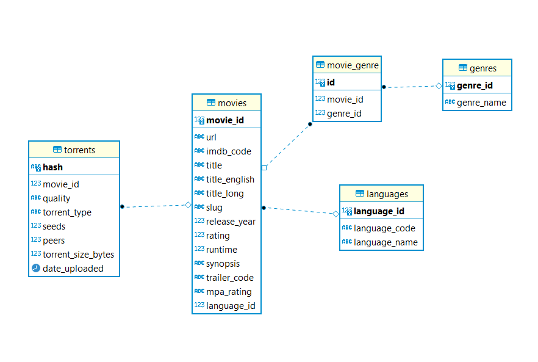

# yts_scrapper_postgresql
scrap the movies website YTS and store data into postgresql database

## this project consume API from a website called YTS that contains movies, then load the data into postgresql database

